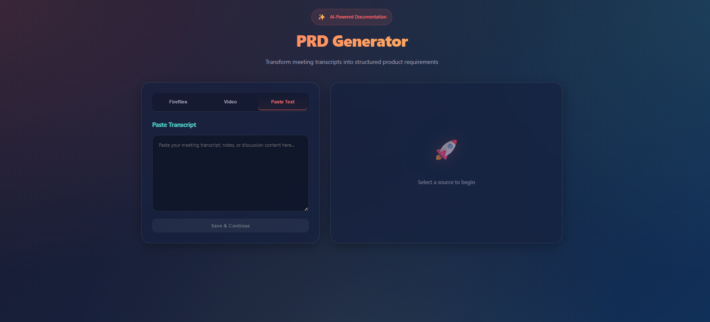

# 🚀 AI Meeting PRD Generator

A powerful full-stack application that transforms meeting transcripts and video/audio recordings into structured, professional Product Requirement Documents (PRDs) using state-of-the-art AI models.

## 🌟 Overview

The **AI Meeting PRD Generator** streamlines the product management workflow by automating the creation of PRDs. Whether you have a raw text transcript, a video recording, or a meeting stored in Fireflies, this tool uses RAG (Retrieval-Augmented Generation) and Advanced LLMs to extract functional requirements, objectives, and deadlines with high precision.

## 🖼️ App Demo



---

## ✨ Key Features

- **📝 Multi-Source Ingestion**: 
  - Paste raw text transcripts.
  - Upload Video/Audio files for automatic transcription (Whisper-v3).
  - Import meetings directly from **Fireflies.ai**.
- **🧠 AI-Powered Generation**: 
  - Uses **Ollama (Local)** or **Groq (Cloud)** for lightning-fast processing.
  - Strict PM-standard templates for consistent output.
  - Zero-temperature configuration for maximum accuracy.
- **⚡ Vector Search & RAG**: 
  - Integrated with **Pinecone** for document chunking and vector storage.
  - Supports future context-aware queries over multiple meetings.
- **💻 Modern Full-Stack Architecture**: 
  - Robust **TypeScript** implementation across frontend and backend.
  - Scalable **Express.js** API and **React** frontend.

---

## 🛠️ Tech Stack

### Frontend
- **Framework**: React 19 (Vite)
- **Language**: TypeScript
- **State Management**: React Hooks
- **Styling**: Vanilla CSS (Modern, Responsive)
- **API Client**: Axios

### Backend
- **Runtime**: Node.js
- **Framework**: Express.js
- **Database**: MongoDB (Mongoose)
- **Vector DB**: Pinecone
- **File Handling**: Multer

### AI & Services
- **Transcription**: Groq (Whisper-large-v3)
- **LLM Engine**: Ollama (Qwen2.5 / Llama3)
- **Embeddings**: Ollama (Nomic-embed-text)
- **Integration**: Fireflies.ai API

---

## 📂 Project Structure

```text
├── backend/
│   ├── src/
│   │   ├── controllers/   # Request handlers (PRD, Transcripts, Fireflies)
│   │   ├── models/        # Mongoose schemas (PRD, Transcript, Chunk)
│   │   ├── routes/        # API Endpoints definition
│   │   ├── services/      # Core logic (AI, Pinecone, Chunking)
│   │   ├── utils/         # API Clients (Ollama, Pinecone)
│   │   └── server.ts      # App entry point
│   └── uploads/           # Temporary storage for video processing
├── frontend/
│   ├── src/
│   │   ├── components/    # Reusable UI elements
│   │   ├── pages/         # Main application views
│   │   └── App.tsx        # Main routing and layout
└── README.md
```

---

## 🚀 Getting Started

### Prerequisites
- [Node.js](https://nodejs.org/) (v18+)
- [MongoDB](https://www.mongodb.com/) (Local or Atlas)
- [Ollama](https://ollama.com/) (Running locally with `qwen2.5:3b` and `nomic-embed-text`)
- [Pinecone Account](https://www.pinecone.io/) (Free tier works)
- [Groq API Key](https://console.groq.com/) (For transcription)

### Backend Setup

1. **Navigate to backend**:
   ```bash
   cd backend
   ```
2. **Install dependencies**:
   ```bash
   npm install
   ```
3. **Configure Environment Variables**:
   Create a `.env` file in the `backend` folder:
   ```env
   PORT=4000
   MONGODB_URI=your_mongodb_uri
   PINECONE_API_KEY=your_pinecone_key
   PINECONE_INDEX=your_index_name
   PINECONE_ENV=your_env
   OLLAMA_BASE_URL=http://localhost:11434
   OLLAMA_MODEL=qwen2.5:3b
   OLLAMA_EMBED_MODEL=nomic-embed-text
   GROQ_API_KEY=your_groq_key
   FIREFLIES_API_KEY=your_fireflies_key
   ```
4. **Start Development Server**:
   ```bash
   npm run dev
   ```

### Frontend Setup

1. **Navigate to frontend**:
   ```bash
   cd frontend
   ```
2. **Install dependencies**:
   ```bash
   npm install
   ```
3. **Configure Environment Variables**:
   Create a `.env` file:
   ```env
   VITE_API_BASE=http://localhost:4000/api
   ```
4. **Start Development Server**:
   ```bash
   npm run dev
   ```

---

## 📖 Usage Guide

1. **Transcribe**: Go to the upload section. Paste a transcript or upload a `.mp4`/`.mp3` file.
2. **Import**: Alternatively, connect to Fireflies to fetch existing meeting notes.
3. **Generate**: Select the meeting and click **"Generate PRD"**.
4. **Review**: The AI will process the text, store chunks in Pinecone, and output a structured PRD including:
   - Feature Name
   - Objective
   - Description
   - Functional Requirements
   - Deadline & Priority
   - Owner

---

## 🔗 API Endpoints

| Method | Endpoint | Description |
|--------|----------|-------------|
| `POST` | `/api/transcripts` | Upload text transcript |
| `POST` | `/api/transcripts/video` | Upload video/audio for transcription |
| `POST` | `/api/prd` | Generate PRD from a transcript ID |
| `GET` | `/api/prd/:id` | Fetch generated PRD |
| `GET` | `/api/fireflies/meetings` | List meetings from Fireflies |

---

## 📈 Future Roadmap

- [ ] **Multi-Model Support**: Toggle between OpenAI, Anthropic, and Local models.
- [ ] **Export Options**: Download PRDs as PDF or Word documents.
- [ ] **Auth**: User accounts and workspace management (clerk or JWT).
- [ ] **Real-time**: Socket.io integration for progress updates during long transcriptions.
- [ ] **Collaboration**: Commenting and editing workflow within the app.

---

## 📄 License

This project is licensed under the MIT License.

---
Developed by [Adarsh](https://github.com/Adarsh09675)
